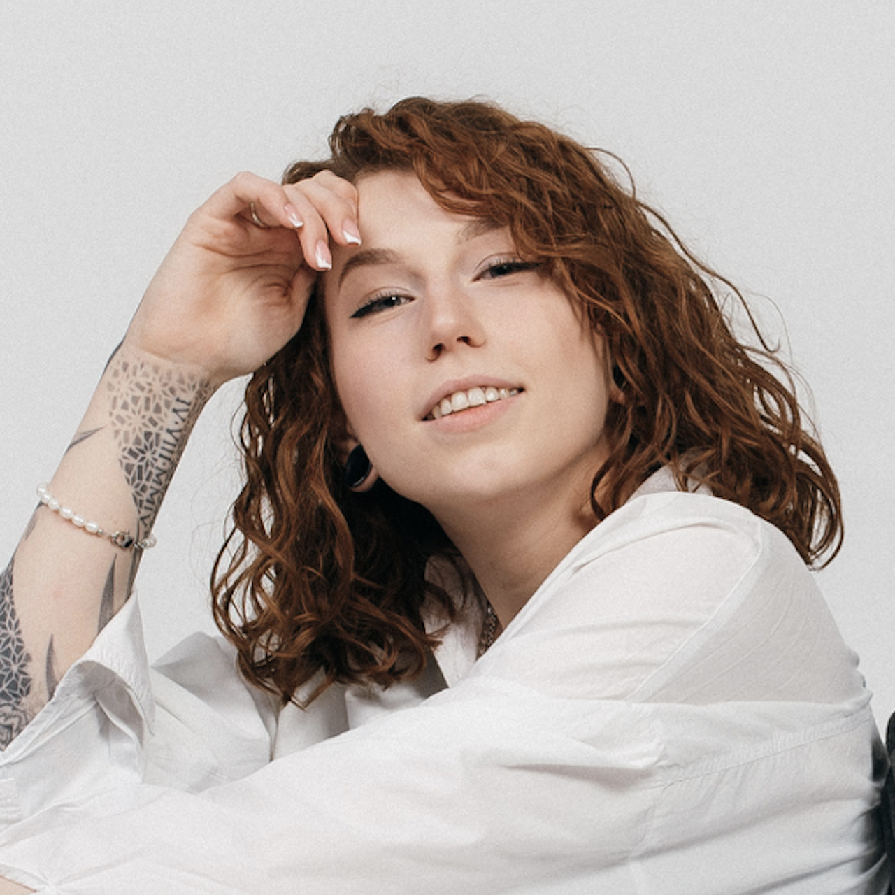

# Arina Stepanova

## Brief information about me

My incomplete education as an advertising artist and going to art school during my middle school days gave me a foundation of knowledge about colors, shapes, combinations and all the creative aspects of front-end development.

The education at the Faculty of Computer Systems and Complexes gave me technical knowledge, confidence in using a PC and the resources necessary for a deeper study of development.

I'm sure that the combination of knowledge gained over the years and my enthusiasm, ability to learn and inspiration will help me improve my skills and become an experienced Frontend developer.

About myself as a person, I can say that I am a sociable, friendly and tolerant person. I love to cook, shoot and edit short videos, do yoga and read all kinds of interesting things.
********* 
