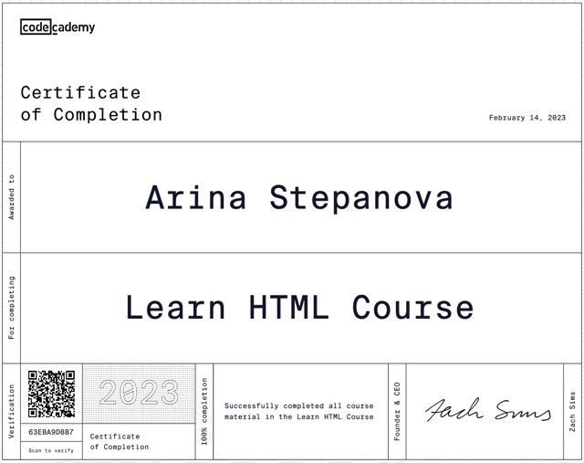
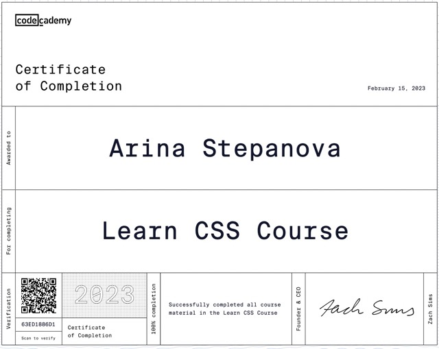
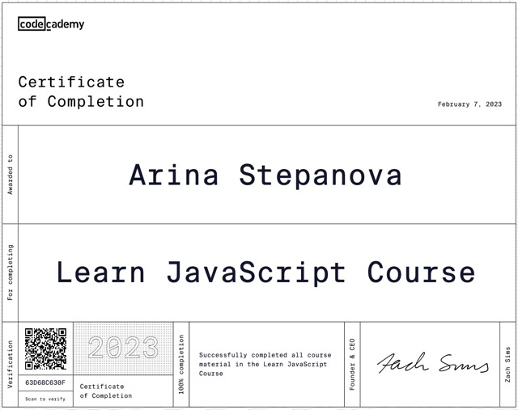

# Arina Stepanova


## Contacts

[LinkedIn](https://www.linkedin.com/in/arina-stepanova-073ab6268/) <br>
[GitHub](https://github.com/arina-stepanova) <br>
**Telegram:** @arinuggets <br>
**E-mail:** <mrs.arina.stepanova@gmail.com> <br>

---

## Brief info about me

I graduated from faculty of Computer Systems and Complexes, and I've got a lot of technical knowledges, the ability to find any information on any resources, confidence in using modern technologies, that is necessary for further learning of development in more depth.

In the art school I've gained a lot of knowledges and expirience with color theory, composition, and all the creative aspects, that can be useful in designing user interfaces.

I'm sure that the combination of the knowledges gained over the years with my enthusiasm, an ability to learn and inspiration will help me to improve my skills and become an experienced front-end developer.

About myself as a person, I can say I'm a sociable, friendly and tolerant. I like to cook, shoot and edit short videos, do yoga and read all kinds of interesting things.

---

## Courses

I have been studying front-end development for about 3 months. During this time, I worked out on my own for some time and completed three mini-courses on the Codecademy platform.





At the moment, I am taking a more complete and detailed course on Codecademy called "Front-end Engineer. Career path" *(>30%)*.

And now I'm also taking the RS School's Course «JavaScript/Front-end. Stage#1».

---

## Skills

- HTML5, CSS3, JavaScript
- Git, GitHub
- Visual Studio Code
- Figma
- Vectornator, Procreate

---

## Code example

This JS code is a simple implementation of a "Magic Eight Ball" game. The program generates random responses to a user's questions, similar to a Magic Eight Ball toy.

```javascript
var userName = window.prompt("What's your name?");

userName ? alert(`Hello, ${userName}!`) : alert('Hello!');

var userQuestion = window.prompt("What's your question?");

alert(`${userName} asks: ${userQuestion}`);

var randomNumber = Math.floor(Math.random() * 5);

switch (randomNumber) {
  case 0:
    alert('Eight Ball says: one hundred percent yes');
    break;
  case 1:
    alert('Eight Ball says: absolutely not');
    break;
  case 2:
    alert('Eight Ball says: the probability is minimal, but there is');
    break;
  case 3:
    alert('Eight Ball says: the probability is very high');
    break;
  default:
    alert('Eight Ball says: for now, I can not say it');
    break;
}
```
---

## Languages

 - Russian *(native)*
 - English *(pre-intermediate)*
